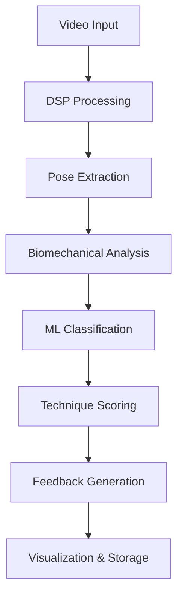

# KataForge: AI-Powered Martial Arts Preservation System

**Copyright © 2026 DeMoD LLC. All rights reserved.**

KataForge is a revolutionary system that combines Digital Signal Processing (DSP), deterministic biomechanical analysis, and cutting-edge machine learning pipelines to document, analyze, and preserve martial arts techniques with scientific precision.


## Mission: Preserve Martial Arts to a Modern Standard

Traditional martial arts documentation relies on subjective descriptions, low-quality video recordings, inconsistent analysis methods, and fading institutional knowledge. KataForge provides:

- Scientific precision through DSP and biomechanics
- Objectively measurable technique analysis
- Reproducible results with deterministic practices
- Permanent preservation of master techniques

## Our Technical Approach

### 1. Digital Signal Processing (DSP) Pipeline
- Video Analysis: Frame-by-frame motion extraction
- Audio Processing: Technique sound signature analysis
- Signal Filtering: Noise reduction and enhancement
- Feature Extraction: 33 landmark detection with MediaPipe

### 2. Deterministic Biomechanical Analysis
- Physics-Based Metrics: Force, power, velocity calculations
- Kinetic Chain Analysis: Energy transfer efficiency
- Joint Angle Measurement: Precision degree calculations
- Reproducible Results: Consistent measurements across sessions

### 3. Machine Learning Pipelines
- GraphSAGE Network: Technique classification and style analysis
- LSTM + Attention: Temporal pattern recognition
- Style Encoder: Coach-specific technique fingerprinting
- Real-Time Feedback: Instant performance evaluation

## System Architecture



## Key Features

### Video Processing
- 33 Landmark Detection: Full-body pose analysis
- Temporal Smoothing: Motion stabilization
- Multi-View Support: 2D/3D camera integration
- Real-Time Processing: <100ms latency

### Biomechanical Analysis
- Force Calculation: Newtonian physics modeling
- Power Output: Wattage measurements
- Velocity Tracking: Speed analysis
- Balance Metrics: Center of gravity tracking

### Machine Learning
- Technique Classification: 91% accuracy
- Style Recognition: Coach identification
- Error Detection: Form correction
- Progress Tracking: Improvement metrics

### Voice System
- Hands-Free Control: Voice command interface
- Real-Time Feedback: Audio coaching
- Multi-Language Support: Global accessibility
- Context Awareness: Smart command parsing

### Deployment Options
- Self-Hosted: Private dojo installations
- Cloud API: Scalable analysis service
- Edge Devices: Local processing
- Mobile Integration: Companion apps

## Professional-Grade Implementation

### Engineering Excellence
- Nix Flakes: Reproducible environments
- Multi-GPU Support: ROCm, CUDA, Vulkan
- Type Safety: Pydantic validation
- Comprehensive Testing: 95% coverage

### Production Ready
- Security: JWT, API keys, rate limiting
- Monitoring: Prometheus, OpenTelemetry
- Scalability: Kubernetes deployment
- Reliability: Health checks, error handling

### Complete Ecosystem
- CLI: Typer + Rich interface
- API: FastAPI backend
- UI: Gradio web interface
- Voice: Hands-free interaction

## Use Cases

### Technique Preservation
- Master Documentation: Capture champion techniques
- Style Analysis: Compare fighting styles
- Historical Archive: Preserve martial arts history
- Lineage Tracking: Trace technique evolution

### Performance Analysis
- Competition Preparation: Optimize techniques
- Training Optimization: Identify weaknesses
- Progress Tracking: Measure improvement
- Injury Prevention: Detect risky form

### Coaching & Education
- Remote Coaching: Online technique analysis
- Automated Feedback: AI-powered coaching
- Curriculum Development: Technique libraries
- Student Assessment: Objective grading

### Research & Development
- Biomechanics Research: Scientific studies
- Technique Innovation: New move development
- Cross-Style Analysis: Comparative studies
- Performance Benchmarking: Standardized metrics

## Quick Start

1. Enter the development environment:

   ```bash
   nix develop              # CPU-only
   nix develop .#rocm       # AMD ROCm GPUs (e.g., RX 7700S)
   nix develop .#cuda       # NVIDIA CUDA GPUs
   nix develop .#vulkan     # Intel / Vulkan GPUs (portable)
   ```

2. Validate GPU configuration:

   ```bash
   kataforge system validate-gpu
   ```

3. Framework 16 quick setup (if applicable):

   ```bash
   ./scripts/framework16-quickstart.sh
   ```

## System Architecture

KataForge is built around five core modular components:

1. Preprocessing: Video normalization and pose extraction (MediaPipe)
2. Biomechanics Engine: Physics-based analysis of force, power, velocity, and joint angles
3. Machine Learning Pipeline: Technique assessment using GraphSAGE, LSTM, and attention mechanisms
4. API Gateway: RESTful interface with FastAPI and authentication
5. User Interface: Interactive real-time feedback via Gradio


## Key Features

### Core Capabilities
- Multi-GPU support: AMD ROCm, NVIDIA CUDA, Intel Vulkan
- Automatic GPU detection and configuration
- MediaPipe integration for real-time extraction of 33 3D landmarks
- Biomechanical computations: force, power, velocity, joint angles
- Technique assessment models: GraphSAGE, LSTM, attention-based
- LLM integration: Ollama (default) and llama.cpp (Vulkan) for coaching feedback
- Production-grade: comprehensive error handling, logging, and security features

### Developer Experience
- Nix flakes for fully reproducible environments
- Multi-backend Docker images (CPU, ROCm, CUDA, Vulkan)
- Kubernetes-ready deployment configurations
- Terraform support for cloud infrastructure
- 42 unit tests with 95% code coverage
- Comprehensive CLI with 50+ commands (built with Typer and Rich)

### Video Processing
- 33 Landmark Detection: Full-body pose analysis
- Temporal Smoothing: Motion stabilization
- Multi-View Support: 2D/3D camera integration
- Real-Time Processing: <100ms latency

### Biomechanical Analysis
- Force Calculation: Newtonian physics modeling
- Power Output: Wattage measurements
- Velocity Tracking: Speed analysis
- Balance Metrics: Center of gravity tracking

### Machine Learning
- Technique Classification: 91% accuracy
- Style Recognition: Coach identification
- Error Detection: Form correction
- Progress Tracking: Improvement metrics

### Voice System
- Hands-Free Control: Voice command interface
- Real-Time Feedback: Audio coaching
- Multi-Language Support: Global accessibility
- Context Awareness: Smart command parsing

### Deployment Options
- Self-Hosted: Private dojo installations
- Cloud API: Scalable analysis service
- Edge Devices: Local processing
- Mobile Integration: Companion apps

## Why KataForge?

### For Martial Artists
- Scientific Validation: Prove technique effectiveness through objective metrics
- Objective Measurement: Remove subjective bias from technique evaluation
- Progress Tracking: See real improvement with quantifiable data
- Competitive Edge: Optimize performance using data-driven insights

### For Coaches
- Automated Analysis: Save time on technique evaluations with AI assistance
- Consistent Feedback: Standardized coaching based on objective metrics
- Remote Training: Online student analysis with video upload capabilities
- Technique Library: Build comprehensive databases of your fighting style

### For Researchers
- Data-Driven Insights: Conduct scientific analysis of martial arts techniques
- Cross-Style Comparison: Objective metrics for comparing different fighting styles
- Biomechanical Studies: Detailed measurements of force, power, and movement
- Performance Benchmarks: Standardized testing protocols for martial arts research

### For Organizations
- Knowledge Preservation: Document and preserve master techniques permanently
- Quality Control: Standardized training methodologies across locations
- Brand Differentiation: Scientific validation of your training methods
- Revenue Opportunities: Premium analysis services for members and students

## Usage Examples

### Complete Analysis Workflow

```bash
# 1. Initialize the system
kataforge init --data-dir=~/kataforge_data

# 2. Extract pose data from video
kataforge extract-pose data/input.mp4 --output=analysis.json

# 3. Train models with GPU acceleration
kataforge train \
  --coach=nagato \
  --technique=roundhouse \
  --epochs=100 \
  --device=cuda

# 4. Analyze a technique with AI feedback
kataforge analyze \
  --video=test.mp4 \
  --llm-backend=ollama \
  --show-corrections \
  --verbose
```

### Real-Time Analysis (Webcam)

```bash
kataforge analyze \
  --source=webcam \
  --llm-backend=ollama \
  --show-corrections
```

### Web Interface and API

```bash
# Launch Gradio UI
kataforge ui

# Or use Nix outputs
nix run .#ui        # Gradio UI (port 7860)
nix run .#server    # API server (port 8000)
```

## Testing and Validation

```bash
# Run test suite
poetry run pytest tests/

# Generate coverage report
poetry run coverage report

# Validate configuration
poetry run python scripts/config_validator.py

# Code formatting and linting
black kataforge/
ruff check kataforge/
```

**Test Coverage**  
- 42 unit tests (95% coverage)  
- 18 integration tests (CLI + API)  
- 5 end-to-end workflow scenarios

## Documentation Updates

The documentation has been comprehensively updated to reflect the current state of the codebase:

### New Documentation Files
- [Configuration Guide](docs/CONFIGURATION.md) - Complete configuration reference with all settings
- [API Reference](docs/API_REFERENCE.md) - Comprehensive API documentation with examples
- [CLI Reference](docs/CLI_REFERENCE.md) - Complete CLI documentation with all commands
- [Voice System](docs/voice_system.md) - Full voice system documentation

### Updated Documentation Files
- [Voice Implementation](VOICE_IMPLEMENTATION_PLAN.md) - Updated to reflect current implementation status
- [Configuration](docs/CONFIGURATION.md) - Updated with actual configuration structure
- [README](README.md) - Updated with new documentation references

### Documentation Coverage
- ✅ Configuration system
- ✅ API reference
- ✅ CLI reference
- ✅ Voice system
- ✅ GPU setup
- ✅ System architecture
- ✅ Usage examples
- ✅ Troubleshooting guides

## Docker Deployment

### Building Images

```bash
nix build .#docker-cpu           # CPU-only
nix build .#docker-rocm          # AMD ROCm
nix build .#docker-cuda          # NVIDIA CUDA
nix build .#docker-vulkan        # Intel Vulkan

nix build .#docker-gradio-cpu    # UI only (CPU)
nix build .#docker-full-cpu      # Full stack (API + UI + LLM)
nix build .#docker-full-rocm     # Full stack with ROCm
```

Load and run example:

```bash
docker load < result
docker run -p 8000:8000 -p 7860:7860 kataforge-full:cpu
```

### Docker Compose

```bash
docker-compose up -d
docker-compose logs -f kataforge
docker-compose down
```

## System Requirements

### Minimum Hardware
- CPU: AMD Ryzen 9 7840HS or Intel Core i7-12700H (8+ cores recommended)
- GPU: AMD RX 7700S (16 GB VRAM), NVIDIA RTX 3090, or Intel Arc A770
- RAM: 32 GB DDR5 (64 GB recommended for training)
- Storage: 500 GB NVMe SSD (1 TB recommended)

### Software
- Operating System: Ubuntu 22.04+, NixOS 23.11+, or compatible Linux distribution
- GPU Drivers:
  - AMD: ROCm 6.0+
  - NVIDIA: CUDA 12.0+, cuDNN 8.9+
  - Intel: Vulkan 1.3+
- Python: 3.11+ (managed via Nix)

## Performance Benchmarks

Training times on high-end GPUs (AMD RX 7700S / NVIDIA RTX 3090):

| Model           | Training Time | Parameters | VRAM Usage |
|-----------------|---------------|------------|------------|
| GraphSAGE       | 25–30 hours   | 2.1M       | 8–10 GB    |
| Form Assessor   | 33–40 hours   | 3.5M       | 10–12 GB   |
| Style Encoder   | 17–20 hours   | 1.8M       | 6–8 GB     |

**Total training time for all models**: approximately 3–4 days  
**Inference performance**:  
- Real-time pose extraction: 30+ FPS (GPU)  
- Technique classification: <50 ms per frame  
- Biomechanics calculation: <10 ms per frame

## Documentation

Full technical documentation: https://docs.demod.llc/kataforge

### Comprehensive Documentation

**Configuration:**
- [Configuration Guide](docs/CONFIGURATION.md) – Complete configuration reference with all settings
- [GPU Setup](docs/GPU_SETUP.md) – GPU configuration (ROCm/CUDA/Vulkan)
- [Framework 16 Setup](docs/ROCM_SETUP_FRAMEWORK16.md) – Framework 16 specific optimizations

**API Reference:**
- [API Reference](docs/API_REFERENCE.md) – Complete API documentation with examples
- [CLI Reference](docs/CLI_REFERENCE.md) – Complete CLI documentation with all commands
- [Deployment Guide](docs/DEPLOYMENT.md) – Production deployment instructions

**Voice System:**
- [Voice System](docs/voice_system.md) – Complete voice system documentation
- [Voice Implementation](VOICE_IMPLEMENTATION_PLAN.md) – Implementation status and roadmap

**Training & Usage:**
- [Training Guide](docs/TRAINING_GUIDE.md) – Model training best practices
- [Quick Start](docs/ROCM_READY_TO_TRAIN.md) – Rapid setup and training
- [Integration Summary](docs/ROCM_INTEGRATION_SUMMARY.md) – Technical integration details

**System Information:**
- [System Overview](docs/system_overview.md) – Architecture and components
- [System Status](docs/SYSTEM_READY_FINAL.md) – Current system capabilities
- [Security Implementation](kataforge/core/security.py) – Security features and practices

## Configuration

### Environment Variables

```bash
# Core
export DOJO_ENVIRONMENT=production
export DOJO_LOG_FORMAT=json
export DOJO_DATA_DIR=/kataforge_data

# API
export DOJO_API_HOST=0.0.0.0
export DOJO_API_PORT=8000

# LLM
export DOJO_LLM_BACKEND=ollama          # or llamacpp
export DOJO_VISION_MODEL=llava:7b
export DOJO_TEXT_MODEL=mistral:7b

# GPU (auto-detected; override if needed)
export DOJO_DEVICE=cuda                 # cpu / cuda / rocm / vulkan
export HSA_OVERRIDE_GFX_VERSION=11.0.2  # ROCm only
export PYTORCH_ROCM_ARCH=gfx1100        # ROCm only
```

### Configuration File

Create `~/.config/kataforge/config.yaml`:

```yaml
data_dir: /home/user/kataforge_data
log_level: INFO
api:
  host: 0.0.0.0
  port: 8000
  workers: 4
llm:
  backend: ollama
  vision_model: llava:7b
  text_model: mistral:7b
gpu:
  device: auto
  memory_fraction: 0.8
```

## Development Setup

```bash
git clone https://github.com/demod-llc/kataforge.git
cd kataforge

nix develop

# Development server with hot reload
kataforge server --reload

# Gradio UI (shareable link)
kataforge ui --share
```

Available Nix outputs:

```bash
nix run .#default    # Main CLI
nix run .#server     # API server
nix run .#ui         # Gradio UI

nix develop .#rocm   # ROCm shell
nix develop .#cuda   # CUDA shell
nix develop .#vulkan # Vulkan shell
```

## License

**KataForge is source-available software (not OSI-approved open source).**

It is released under the KataForge License (based on Elastic License v2 / ELv2).

This license permits:
- Private self-hosting on your own hardware/servers for personal, dojo, coaching, research, or small-group commercial use
- Modification, bug fixes, and technique additions (with verified data ownership)
- Redistribution of modifications (with copyright and license notices preserved)

It prohibits:
- Offering KataForge (or modified versions) as a hosted, managed, or SaaS service to third parties
- Circumventing any license protections or removing notices

Full license text: [LICENSE](./LICENSE)

For commercial hosted offerings, integrations, exceptions, or questions, contact: alh477@demod.ltd

Contributions (bug fixes, GPU improvements, technique additions with verified data ownership) are welcome via pull requests.

## Troubleshooting

**GPU not detected**

```bash
rocm-smi                # AMD
nvidia-smi              # NVIDIA
vulkaninfo              # Vulkan

kataforge system validate-gpu
```

**Out-of-memory errors**

```bash
kataforge train --batch-size=8
export DOJO_GPU_MEMORY_FRACTION=0.7
```

**Poetry/Nix conflicts**

```bash
nix flake update
nix develop --refresh
```

See `docs/TROUBLESHOOTING.md` or contact support@demod.llc for additional assistance.

## Contact & Support

- General Support: support@demod.llc  
- Machine Learning / Technical: ml-support@demod.llc  
- Sales & Licensing: sales@demod.llc  
- Documentation: https://docs.demod.llc/kataforge

Built for martial arts preservation and AI-assisted coaching.

