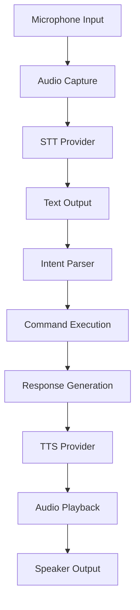

# KataForge Voice System

## Overview

KataForge features a comprehensive voice interaction system that enables hands-free operation during martial arts training. The voice system supports speech-to-text (STT) for command input and text-to-speech (TTS) for providing audio feedback.

## Architecture

The voice system is organized into several modular components:

```
kataforge/voice/
├── __init__.py        # Base classes and interfaces
├── stt.py            # Speech-to-Text implementations
├── tts.py            # Text-to-Speech implementations
├── voice_manager.py  # Main voice system controller
├── audio_utils.py    # Audio processing utilities
└── __pycache__/
```

## Core Components

### 1. Base Classes

#### STTProvider (Speech-to-Text)

Abstract base class for all STT implementations:

```python
class STTProvider:
    async def transcribe(self, audio, sample_rate) -> str:
        """Convert audio to text"""
        pass
    
    async def is_available(self) -> bool:
        """Check if the STT provider is available"""
        pass
    
    async def get_languages(self) -> List[str]:
        """Get supported languages"""
        pass
```

#### TTSProvider (Text-to-Speech)

Abstract base class for all TTS implementations:

```python
class TTSProvider:
    async def synthesize(self, text) -> Tuple[bytes, int]:
        """Convert text to audio"""
        pass
    
    async def is_available(self) -> bool:
        """Check if the TTS provider is available"""
        pass
    
    async def get_voices(self) -> List[Dict[str, str]]:
        """Get available voices"""
        pass
    
    async def set_voice(self, voice_id) -> bool:
        """Set the voice to use"""
        pass
```

### 2. Voice Intent System

The system recognizes these voice commands:

| Command | Description | Example |
|---------|-------------|---------|
| Technique Analysis | Analyze a specific technique | "analyze my roundhouse kick" |
| Technique Selection | Select technique for analysis | "set technique to teep" |
| Feedback Repeat | Repeat last feedback | "repeat feedback" |
| Score Inquiry | Get current score | "what's my score" |
| Help | Show available commands | "help" |
| Voice Toggle | Enable/disable voice mode | "voice on", "voice off" |

### 3. IntentParser

Parses voice commands into executable actions:

```python
class IntentParser:
    def __init__(self):
        self.intents = []
        self._load_default_intents()
    
    def _load_default_intents(self):
        """Load default voice commands"""
        pass
    
    def parse(self, text):
        """Parse text into intent"""
        return intent
    
    def get_help_text(self):
        """Get help text for voice commands"""
        return help_text
```

### 4. VoiceManager

Main controller that manages voice input/output:

```python
class VoiceManager:
    def __init__(self, stt_provider="whisper", tts_provider="piper", 
                 voice_mode=False, wake_word="hey coach", language="en"):
        self.stt_provider = stt_provider
        self.tts_provider = tts_provider
        self.voice_mode = voice_mode
        self.wake_word = wake_word
        self.language = language
        self.stt = None
        self.tts = None
        self.intent_parser = IntentParser()
        self.last_feedback = ""
        self.is_listening = False
        self._initialized = False
```

## STT Providers

### 1. Whisper STT

Primary offline STT using OpenAI's Whisper model:

```python
class WhisperSTT(STTProvider):
    def __init__(self, model="base", device="auto", language="en"):
        self.model = model
        self.device = device
        self.language = language
        self._initialized = False
```

**Features**:
- Offline operation (no internet required)
- Multiple model sizes (tiny, base, small, medium, large)
- Multi-language support
- GPU acceleration (CUDA, ROCm)

**Usage**:
```python
stt = WhisperSTT(model="base", device="cuda")
text = await stt.transcribe(audio_data, sample_rate)
```

### 2. Browser STT

Web-based STT using browser APIs:

```python
class BrowserSTT(STTProvider):
    def __init__(self, language="en-US"):
        self.language = language
```

**Features**:
- No installation required
- Uses browser's built-in STT
- Works in web UI

**Usage**:
```python
stt = BrowserSTT(language="en-US")
text = await stt.transcribe(audio_data, sample_rate)
```

## TTS Providers

### 1. Piper TTS

Fast, low-latency TTS using Piper model:

```python
class PiperTTS(TTSProvider):
    def __init__(self, voice="en_US-lessac-medium", device="auto"):
        self.voice = voice
        self.device = device
        self.model = None
        self._initialized = False
```

**Features**:
- Low-latency speech synthesis
- Small footprint
- CPU/Vulkan acceleration
- Multiple voices available

**Available Voices**:
- `en_US-lessac-medium` - American English (Lessac)
- `en_US-vctk-medium` - American English (VCTK)
- `en_GB-vctk-medium` - British English (VCTK)
- `es_ES-medium` - Spanish (Spain)
- `fr_FR-medium` - French (France)
- `de_DE-medium` - German (Germany)
- `it_IT-medium` - Italian (Italy)
- `ja_JP-medium` - Japanese (Japan)
- `ko_KR-medium` - Korean (Korea)
- `zh_CN-medium` - Chinese (China)

**Usage**:
```python
tts = PiperTTS(voice="en_US-lessac-medium", device="vulkan")
audio, sample_rate = await tts.synthesize("Your technique score is 8.5")
```

### 2. Coqui TTS

High-quality TTS using Coqui TTS (XTTS):

```python
class CoquiTTS(TTSProvider):
    def __init__(self, voice="v2_en", device="auto"):
        self.voice = voice
        self.device = device
        self.model = None
        self._initialized = False
```

**Features**:
- High-quality voice synthesis
- GPU acceleration (CUDA)
- Multi-language support
- Emotional voice styles

**Available Voices**:
- `v2_en` - English (default)
- `v2_es` - Spanish
- `v2_fr` - French
- `v2_de` - German
- `v2_it` - Italian
- `v2_ja` - Japanese
- `v2_ko` - Korean
- `v2_zh` - Chinese
- `v2_ru` - Russian
- `v2_ar` - Arabic

**Usage**:
```python
tts = CoquiTTS(voice="v2_en", device="cuda")
audio, sample_rate = await tts.synthesize("Excellent technique execution!")
```

### 3. Edge TTS

Cloud-based TTS using Microsoft Edge TTS:

```python
class EdgeTTS(TTSProvider):
    def __init__(self, voice="en-US-JennyNeural", language="en-US"):
        self.voice = voice
        self.language = language
```

**Features**:
- Cloud-based (requires internet)
- High-quality neural voices
- Wide language support
- No local installation required

**Available Voices**:
- `en-US-JennyNeural` - English (US) - Jenny
- `en-US-GuyNeural` - English (US) - Guy
- `en-GB-SoniaNeural` - English (UK) - Sonia
- `es-ES-ElviraNeural` - Spanish (Spain) - Elvira
- `fr-FR-DeniseNeural` - French (France) - Denise
- `de-DE-KatjaNeural` - German (Germany) - Katja
- `it-IT-ElsaNeural` - Italian (Italy) - Elsa
- `ja-JP-NanamiNeural` - Japanese (Japan) - Nanami
- `ko-KR-SunHiNeural` - Korean (Korea) - SunHi
- `zh-CN-XiaoxiaoNeural` - Chinese (China) - Xiaoxiao

**Usage**:
```python
tts = EdgeTTS(voice="en-US-JennyNeural")
audio, sample_rate = await tts.synthesize("Your balance needs improvement")
```

## Configuration

### Settings

Configure voice system in `kataforge/core/settings.py`:

```python
# Voice settings
tts_enabled: bool = True
tts_provider: str = "piper"tts_voice: str = "en_US-lessac-medium"
tts_speed: float = 1.0
stt_enabled: bool = True
stt_provider: str = "whisper"
stt_model: str = "base"
stt_language: str = "en"
voice_activation_phrase: str = "hey coach"
voice_feedback_auto_play: bool = True
```

### Environment Variables

```bash
# Enable/disable voice features
export DOJO_TTS_ENABLED=true
export DOJO_STT_ENABLED=true

# Select providers
export DOJO_TTS_PROVIDER=piper
export DOJO_STT_PROVIDER=whisper

# Configure voice
export DOJO_TTS_VOICE=en_US-lessac-medium
export DOJO_TTS_SPEED=1.0
export DOJO_STT_LANGUAGE=en

# Wake word
export DOJO_VOICE_ACTIVATION_PHRASE="hey coach"
export DOJO_VOICE_FEEDBACK_AUTO_PLAY=true
```

## Usage Examples

### Basic Usage

```python
from kataforge.voice import VoiceManager

# Initialize voice manager
voice = VoiceManager(
    stt_provider="whisper",
    tts_provider="piper",
    voice_mode=True,
    wake_word="hey coach"
)

# Transcribe speech
audio_data = load_audio("command.wav")
text = await voice.transcribe(audio_data, 16000)
print(f"Recognized: {text}")

# Synthesize speech
feedback = "Your roundhouse kick scored 8.5 out of 10"
audio, sample_rate = await voice.synthesize(feedback)
play_audio(audio, sample_rate)
```

### Voice Command Processing

```python
# Process voice command
result = await voice.analyze_voice_command(audio_data, sample_rate)
print(f"Action: {result['action']}")
print(f"Response: {result['response']}")

# Play response audio
if result['audio']:
    play_audio(result['audio'], result['sample_rate'])
```

### Gradio UI Integration

```python
import gradio as gr
from kataforge.voice import VoiceManager

voice = VoiceManager()

def voice_command(audio):
    """Process voice command from Gradio UI"""
    result = await voice.analyze_voice_command(audio[0], audio[1])
    return result['response'], (result['sample_rate'], result['audio'])

# Create Gradio interface
with gr.Blocks() as demo:
    with gr.Row():
        audio_input = gr.Audio(label="Voice Command", type="numpy")
        text_output = gr.Textbox(label="Response")
        audio_output = gr.Audio(label="Feedback", type="numpy")
    
    submit_btn = gr.Button("Submit")
    submit_btn.click(
        voice_command,
        inputs=[audio_input],
        outputs=[text_output, audio_output]
    )

demo.launch()
```

## CLI Integration

```bash
# Enable voice mode in CLI
export DOJO_TTS_ENABLED=true
export DOJO_STT_ENABLED=true

# Use voice commands
kataforge ui --voice-mode
```

## Performance Optimization

### GPU Acceleration

```python
# Use GPU for STT/TTS
stt = WhisperSTT(model="base", device="cuda")
tts = CoquiTTS(voice="v2_en", device="cuda")
```

### Caching

```python
# Cache frequently used voices
voice_manager = VoiceManager()
await voice_manager.initialize()  # Load models once
```

### Asynchronous Processing

```python
# Use async/await for non-blocking operation
async def process_voice_command():
    audio = await record_audio()
    text = await voice.transcribe(audio)
    intent = await voice.parse_intent(text)
    response = await voice.synthesize(intent.response)
    await play_audio(response)
```

## Troubleshooting

### STT Not Working

```bash
# Check if Whisper is available
python -c "import whisper; print('Whisper available')"

# Install Whisper
pip install whisper

# Check microphone permissions
arecord -l  # Linux
```

### TTS Not Working

```bash
# Check if Piper is available
python -c "import piper; print('Piper available')"

# Install Piper
pip install piper-tts

# Download voice models
wget https://huggingface.co/rhasspy/piper-voices/resolve/main/en_US/lessac/medium/en_US-lessac-medium.onnx
```

### Voice Quality Issues

```bash
# Adjust microphone settings
alsamixer  # Linux

# Reduce background noise
arecord -D hw:1,0 -f cd -d 5 test.wav

# Test with different STT models
kataforge ui --stt-model small
```

## Advanced Features

### Custom Voice Commands

```python
# Add custom voice commands
intent_parser = voice.intent_parser
intent_parser.add_intent(
    name="custom_command",
    patterns=["do custom action", "perform special move"],
    action=lambda: custom_action()
)
```

### Voice Profiles

```python
# Create voice profiles for different users
user1_voice = VoiceManager(
    tts_voice="en_US-lessac-medium",
    tts_speed=1.1
)

user2_voice = VoiceManager(
    tts_voice="en_GB-vctk-medium", 
    tts_speed=0.9
)
```

### Multi-language Support

```python
# Switch languages dynamically
voice.set_language("es")
voice.set_stt_language("es")
voice.set_tts_voice("es_ES-medium")
```

## Voice System Architecture



## Future Enhancements

1. **Voice Profile Learning** - Adapt to individual user voice patterns
2. **Multi-language Support** - Expanded language coverage
3. **Custom Voice Cloning** - Personalized coach voices
4. **Gesture Integration** - Combine voice with gesture recognition
5. **Offline Mode** - Fully local processing without internet
6. **Smart Context Awareness** - Understand training context
7. **Progress Tracking** - Voice-based progress reporting

## Best Practices

1. **Use GPU Acceleration** for better performance
2. **Cache Models** to reduce startup time
3. **Use Async/Await** for non-blocking UI
4. **Test Microphone** before training sessions
5. **Adjust Volume** for optimal recognition
6. **Use Wake Word** to avoid false triggers
7. **Monitor Performance** and adjust settings as needed

## Security Considerations

1. **Voice Data Privacy** - Process audio locally when possible
2. **Authentication** - Use wake word to prevent accidental activation
3. **Data Storage** - Don't store raw audio without consent
4. **Network Security** - Use HTTPS for cloud-based TTS

## Performance Metrics

| Provider | Latency | Quality | Offline | GPU Support |
|----------|---------|---------|---------|-------------|
| Piper TTS | Low | Medium | Yes | Vulkan |
| Coqui TTS | Medium | High | Yes | CUDA |
| Edge TTS | Medium | High | No | No |
| Whisper STT | Medium | High | Yes | CUDA/ROCm |
| Browser STT | Low | Medium | Yes | No |

## Integration with KataForge Components

### CLI Integration

```bash
# Use voice commands in CLI
kataforge analyze --video=technique.mp4 --coach=nagato --voice-feedback
```

### API Integration

```python
# Voice endpoints in FastAPI
@app.post("/voice/command")
async def voice_command(audio: UploadFile):
    audio_data = await audio.read()
    result = await voice_manager.analyze_voice_command(audio_data)
    return result
```

### Gradio UI Integration

```python
# Voice controls in Gradio
with gr.Accordion("Voice Settings"):
    voice_enabled = gr.Checkbox(label="Enable Voice", value=True)
    tts_provider = gr.Dropdown(
        choices=["piper", "coqui", "edge"],
        label="TTS Provider",
        value="piper"
    )
    stt_provider = gr.Dropdown(
        choices=["whisper", "browser"],
        label="STT Provider",
        value="whisper"
    )
```

## Voice Command Reference

### Basic Commands

| Command | Description | Example |
|---------|-------------|---------|
| Help | Show available commands | "help" |
| Voice On | Enable voice mode | "voice on" |
| Voice Off | Disable voice mode | "voice off" |
| Repeat | Repeat last feedback | "repeat" |
| Score | Get current score | "what's my score" |

### Analysis Commands

| Command | Description | Example |
|---------|-------------|---------|
| Analyze | Analyze technique | "analyze my roundhouse kick" |
| Set Technique | Select technique | "set technique to teep" |
| Set Coach | Select coach | "set coach to nagato" |
| Show Corrections | Show corrections | "show corrections" |

### Feedback Commands

| Command | Description | Example |
|---------|-------------|---------|
| Detailed Feedback | Get detailed feedback | "give detailed feedback" |
| Next Tip | Get next training tip | "next tip" |
| Previous Tip | Repeat previous tip | "previous tip" |
| Explain Score | Explain scoring | "explain my score" |

### System Commands

| Command | Description | Example |
|---------|-------------|---------|
| Status | Show system status | "system status" |
| Version | Show version | "what version is this" |
| Exit | Exit application | "exit", "quit" |

## Configuration Files

### Voice Configuration Example

```yaml
# config/voice.yaml
voice:
  enabled: true
  stt:
    provider: "whisper"
    model: "base"
    language: "en"
  tts:
    provider: "piper"
    voice: "en_US-lessac-medium"
    speed: 1.0
  wake_word: "hey coach"
  auto_play: true
```

## Error Handling

The voice system includes comprehensive error handling:

```python
try:
    text = await voice.transcribe(audio_data, sample_rate)
except STTError as e:
    logger.error(f"STT failed: {e}")
    # Fallback to alternative provider
    fallback_stt = BrowserSTT()
    text = await fallback_stt.transcribe(audio_data, sample_rate)
except Exception as e:
    logger.error(f"Voice processing failed: {e}")
    # Provide user feedback
    await voice.speak("Sorry, I didn't catch that. Please try again.")
```

## Voice System in Production

### Performance Optimization

```python
# Optimize for production
voice = VoiceManager(
    stt_provider="whisper",
    tts_provider="piper",
    voice_mode=True
)

# Pre-load models
await voice.initialize()

# Use caching
@lru_cache(maxsize=32)
async def cached_synthesize(text):
    return await voice.synthesize(text)
```

### Monitoring

```python
# Monitor voice system performance
voice_performance = {
    'stt_latency': [],
    'tts_latency': [],
    'command_success': 0,
    'command_failure': 0
}

async def monitor_voice_command():
    start = time.time()
    try:
        result = await voice.analyze_voice_command(audio)
        voice_performance['command_success'] += 1
    except Exception:
        voice_performance['command_failure'] += 1
    finally:
        voice_performance['tts_latency'].append(time.time() - start)
```

## Voice System Development

### Adding New STT Providers

```python
class CustomSTT(STTProvider):
    async def transcribe(self, audio, sample_rate):
        # Implement custom STT
        return "transcribed text"
    
    async def is_available(self):
        # Check availability
        return True
    
    async def get_languages(self):
        # Return supported languages
        return ["en", "es", "fr"]

# Register provider
voice_manager = VoiceManager(stt_provider="custom")
```

### Adding New TTS Providers

```python
class CustomTTS(TTSProvider):
    async def synthesize(self, text):
        # Implement custom TTS
        return audio_data, sample_rate
    
    async def is_available(self):
        # Check availability
        return True
    
    async def get_voices(self):
        # Return available voices
        return [{"name": "custom", "description": "Custom voice"}]
    
    async def set_voice(self, voice_id):
        # Set voice
        return True

# Register provider
voice_manager = VoiceManager(tts_provider="custom")
```

## Conclusion

The KataForge voice system provides a powerful hands-free interface for martial arts training. With support for multiple STT and TTS providers, GPU acceleration, and comprehensive error handling, it enables natural language interaction with the training system.

For best results:
- Use GPU acceleration when available
- Test microphone setup before training
- Adjust voice settings for your environment
- Use the wake word to prevent false triggers
- Monitor performance and adjust as needed
